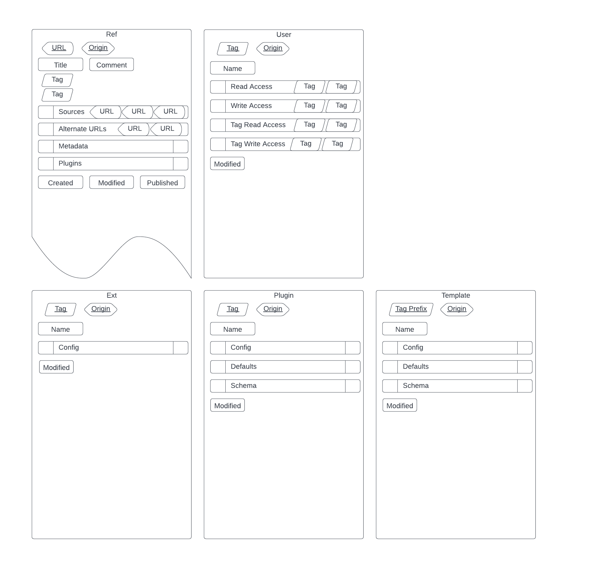

# Jasper
Knowledge Management Server

[](https://github.com/cjmalloy/jasper/actions/workflows/docker-image.yml)
[](https://app.swaggerhub.com/apis/cjmalloy/Jasper)
[](https://artifacthub.io/packages/helm/jasper/jasper)

## Quickstart
To start the server, client and database with a single admin user, run
the [quickstart](https://github.com/cjmalloy/jasper-ui/blob/master/quickstart/docker-compose.yaml)
docker compose file. See [Jasper App](https://github.com/cjmalloy/jasper-app) for an installable
electron wrapper.

## Knowledge Management
Jasper is an open source knowledge management (KM) system. A KMS is similar to a Content Management
System (CMS), but it does not store any content. Instead, a KMS stores links to content. This means
that adding a KM to your internal tools is quick and easy. It will create an overlay database, 
which is a small and fast index of all your content sources. Extend functionality with custom plugins,
or embed existing dashboard panels directly to create your central business intelligence dashboard.

See [Jasper-UI](https://github.com/cjmalloy/jasper-ui) for documentation on the reference client.

### Centralized Business Intelligence
Dumping all department-level data into a central data lake to perform analytics on is a hugely complicated
task with no proven benefit. Instead, empower departments to run their own analytics and formalize the
reporting format to allow centralized aggregation.

Build a Business Intelligence (BI) dashboard without building a data lake. Business departments can use
both a push or pull model to publish their analytics, reports, results, KPIs, graphs, metrics or alerts.
Jasper standardises the transport, storage, searching, indexing, and retrieval of data while allowing you
to use your existing data structures and formats. Stitch together department-level resources to create
a central overview that explicitly describes dependencies.

### Security
Jasper uses Tag Based Access Control (TBAC) to assign fine grained access controls to any object in the
system. This system is simple and powerful, such that the entire security specification is contained
in a [small, readable file](https://github.com/cjmalloy/jasper/blob/master/src/main/java/jasper/security/Auth.java).

### Build your own client
Connect to Jasper with a custom client to give users a streamlined user experience (UX). Frontend
developers can create a bespoke interface without needing to make any server side changes. Create custom
plugins and templates and ensure data integrity with [JTD](https://jsontypedef.com/docs/jtd-in-5-minutes/)
schemas. Fork [the reference client](https://github.com/cjmalloy/jasper-ui) or use the
[OpenApi docs](https://app.swaggerhub.com/apis/cjmalloy/Jasper) to generate API stubs.

## Standards
Jasper is a standard data model and API. While JSON is used in this document, Jasper may be generalised
to other presentations, such as XML, YAML, or TOML.
Jasper defines five entity types, an access control model, and a plugin/templating system for extending
the model.
1. Ref
2. Ext
3. User
4. Plugin
5. Template

The main entity is the Ref, it represents a reference to external content. The main field in a Ref
is the URL field which can be a link to a web page, or a reference to arbitrary resources predicated
on the URL scheme. Web content will of course use the http or https scheme. To reference a book,
one could use the [ISBN](https://en.wikipedia.org/wiki/ISBN) scheme (i.e. `isbn:978-3-16-148410-0`).
For comments, [Jasper-UI](https://github.com/cjmalloy/jasper-ui) uses a `comment` scheme followed by an arbitrary ID, usually a UUID
(i.e. `comment:75b36465-4236-4d64-8c78-027d87f3c072`). For hosting internal wikis, 
[Jasper-UI](https://github.com/cjmalloy/jasper-ui) uses a `wiki` scheme followed by the
[Wiki Page Name](https://en.wikipedia.org/wiki/Wikipedia:Page_name) (i.e. `wiki:John_Cena`).

Like the [OSI model](https://en.wikipedia.org/wiki/OSI_model), Jasper's data model is defined in layers:
1. Identity Layer
2. Indexing Layer
3. Application Layer
4. Plugin Layer

## Tagging
Jasper support hierarchical tagging of Refs. Tags are not entities, they are strings with
regex `[_+]?[a-z0-9]+([./][a-z0-9]+)*`. Tags are part of the primary key for Tag-like entities, but no
entities need exist to use a tag.  
Refs have a list of tags which can be used for categorization, permissions, and plugins.  
There are three types of tags, which the type defined as a semantic ontology:
`public`, `+protected`, `_private` tags. The character prefix defines the type while also being
part of the tag itself. Therefore, no lookup is ever required to determine the tag type.
 * A public tag can be used freely by anyone. This includes tagging a Ref, or using it in a query.
 * A protected tag can freely be used in a query, but you cannot tag a Ref with a protected tag
unless it is in your [read access](#access-control) list.
 * A private tag cannot be used at all unless permission is given. When fetching a Ref that includes
private tags, they will be removed by the server prior to sending. See
[access control](#access-control) for more.

Tags may also be fully qualified by appending the origin. (i.e. `tag@origin`).  
Use forward slashes to define hierarchical tags (i.e. `people/murray/bill` or  `people/murray/anne`)

## Querying
When fetching a page or Refs a query may be specified. The query language uses simple set-like
operators to match Refs according to their tag list and Origin. You may use tags, origins, or
fully qualified tags (tag + origin). There is a special origin `@` which will match the
default origin `""` (the empty string).  
If a tag is not fully qualified it will match the wildcard origin `"@*"`. The `*`
wild card can be used to match anything on the default origin `""` (empty string).
Valid operators in a query are:
1. `:` and
2. `|` or
3. `!` not
4. `()` groups

Note: In the current implementation, groups may not be nested.

Example queries:
 * `science`: All Refs that include the `science` tag
 * `science|funny`: All Refs that have either the `science` tag or the `funny` tag
 * `science:funny`: All Refs that have both the `science` tag and the `funny` tag
 * `science:!funny`: All Refs that have the `science` tag but do not have the `funny` tag
 * `(science|math):funny`: All Refs that have either the `science` or `math` tags, but
also the `funny` tag. This would match a ref with `['science', 'funny']`, `['math', 'funny']`,
but would not match `['science', 'math']`
 * `science:funny|math:funny`: Expended form of previous query. Would produce the exact same results.
 * `music:people/murray`: All Refs that have the `music` tag and `people/murray` tag. It would also
match Refs with `['music', 'people/murray/anne']` or `['music', 'people/murray/bill']`

## Extending
Jasper allows extensive modification with server reuse. Since changes are done by creating
Plugin and Template entities, server restarts are not required.  
This method of extensions means that only client changes are required. The same Jasper server,
without any code modifications, can be used. The client can define and support its own Plugins
and Templates. This allows for much more flexible development, as writing client code (in particular
web clients) is much easier than writing server code. A developer with only front-end expertise 
can extend the Jasper model to support arbitrary applications.  
In order to extend the functionality of a Ref, a developer may choose a set of tags or URL scheme
and a convention by which they modify the semantics of a Ref. If a custom data model is also
required, a Plugin entity may be created which defines a
[JTD](https://jsontypedef.com/docs/jtd-in-5-minutes/) schema. A Plugin is a Tag-like entity. When
a Ref is tagged with a Plugin, the Plugin may be considered active for that Ref. The Ref may then
store data in its config field and the server will validate it according to the schema.  
Similarly, Ext entities may be created which extend the functionality of a tag. As Plugins define
custom data that can be stored in a ref, Templates may be created which allow custom data to be
stored in Ext entities and similarly validated according to their schema.

See [Jasper-UI](https://github.com/cjmalloy/jasper-ui) for examples of Plugins and Templates, such as:
* `plugin/thumbanail`: [This plugin](https://github.com/cjmalloy/jasper-ui/blob/master/src/app/plugin/thumbnail.ts)
allows a Ref to include a URL to a thumbnail image.
* `user` Template: 
[This template](https://github.com/cjmalloy/jasper-ui/blob/master/src/app/template/user.ts)
allows a user tag to customize their experience, such as subscribing to a list of tags to show
on their home page.

## Entities
There are two types of entities in Jasper:
1. Refs
2. Tags (including Exts, Plugins, Templates, and Users)


Origins are used to facilitate replication and multi-tenant operation. Each origin represents a
jasper instance that that entity originated from.


### Ref
Refs are the main data model in Jasper. A Ref defines a URL to a remote resource. Example:
```json 
{
  "url": "https://www.youtube.com/watch?v=9Gn4rmQTZek",
  "origin": "",
  "title": "Why does Science News Suck So Much?",
  "comment": "Sabine Hossenfelder",
  "tags": ["public", "youtube", "sabine"],
  "sources": [],
  "alternateUrls": [],
  "plugins": {
    "plugin/thumbnail": {"url": "https://...jpg"}
  },
  "metadata": {
    "responses": 0,
    "internalResponses": 0,
    "plugins": {},
    "modified": "2022-06-18T12:07:04.404272Z"
  },
  "published": "2022-06-18T12:00:07Z",
  "created": "2022-06-18T12:07:04.404272Z",
  "modified": "2022-06-18T12:07:04.404272Z"
}
```
Only the "url", "origin", "created", "modified", and "published" fields are required.

The combination of URL (including Alternate URLs) and Origin for this Ref must be unique and may
be used as a Primary Composite Key. Implementations may also make the modified date part of the
composite primary key for version history.

**URL:** The url of the resource.  
**Origin:** The Origin this Ref was replicated from, or the empty string for local.  
**Title:** Optional title for this Ref.  
**Comment:** Optional comment for this Ref, usually markdown.  
**Tags:** A list of tags used to categorise this Ref. All tags must match the regex `[_+]?[a-z0-9]+([./][a-z0-9]+)*`  
**Sources:** A list of URLs which are sources for this Ref. These may or may not have a corresponding Ref
entity. If a source URL does correspond to a Ref, the published date of the source must predate the
published date of this Ref.  
**Alternate URLs:** Alternate URLs which should be considered synonymous with the URL of this Ref. This
should be used as part of a uniqueness check when ingesting Refs.  
**Plugins:** A JSON object with plugin tags as fields and arbitrary JSON data defined by each respective
plugin. Must be valid according to each plugin's schema.  
**Metadata:** Optional data generated by the server for this resource. Includes response links (inverse
source lookup).  
**Published:** The published date of this resource. Default to create date if not known. This date must
be later than the published date of all sources.  
**Created:** Created date of this Ref.  
**Modified:** Last modified date of this Ref. If this is the same as the created date no modification
has occurred. Does not update if Metadata is modified.  

### Ext
An Ext is a Tag-like entity representing a Tag extension.
```json 
{
  "tag": "news",
  "origin": "",
  "name": "News",
  "config": {
    "pinned":[],
    "sidebar": ""
  },
  "modified": "2022-06-18T16:00:59.978700Z"
}
```
Only the "tag", "origin", and "modified" fields are required.

An Ext allows you to customise a Tag page. For example, you could set the sidebar text or pin some links.

**Tag:** The tag of this Ext. Must match the regex `[_+]?[a-z0-9]+([./][a-z0-9]+)*`
**Origin:** The Origin this Ext was replicated from, or the empty string for local.
**Name:** The display name of this Ext. Used to customise the page title for the Tag page.
**Config:** Arbitrary JSON data defined by Templates. Must be valid according to each template's schema.
**Modified:** Last modified date of this Ext

### User
A User is a Tag-like entity representing a user.
```json 
{
  "tag": "+user/charlie",
  "origin": "",
  "name": "Charlie Brown",
  "readAccess": [],
  "writeAccess": [],
  "tagReadAccess": [],
  "tagWriteAccess": [],
  "pubKey": "...",
  "modified": "2022-06-18T16:00:59.978700Z"
}
```
Only the "tag", "origin", and "modified" fields are required.

A User contains the access control information for the system. In multi-tenant mode access tags
are for the same origin as the user. In normal mode access tags are for all origins.

**Tag:** The tag of this User. Must match the regex `[_+]user/[a-z0-9]+([./][a-z0-9]+)*`  
**Origin:** The Origin this User was replicated from, or the empty string for local.  
**Name:** The display name of this User. Used to customise the page title for the Tag page.  
**Read Access:** List of tags this user has complete read access to. Grants read access to all
entities with this tag.  
**Write Access:** List of tags this user has complete write access to. Grants write access to
all entities with this tag.  
**Tag Read Access:** List of tags this user can read. Only applies to Tag-like entities. Only needed
for private tags.  
**Tag Write Access:** List of tags this user can write. Only applies to Tag-like entities.  
**Pub Key:** Base 64 encoded public RSA key. Used for verifying signatures to validate authorship.  
**Modified:** Last modified date of this User.  

### Plugin
A Plugin is a Tag-like entity used to extend the functionality of Refs.
```json 
{
  "tag": "plugin/thumbnail",
  "origin": "",
  "name": "Thumbnail Plugin",
  "config": {...},
  "defaults": {},
  "schema": {
    "optionalProperties": {
      "url": {"type": "string"},
      "width": {"type": "int32", "nullable": true},
      "height": {"type": "int32", "nullable": true}
    }
  },
  "generateMetadata": false,
  "userUrl": false,
  "modified": "2022-06-18T16:27:13.774959Z"
}
```
Only the "tag", "origin", and "modified" fields are required.

Tagging a ref with a Plugin tag applies that plugin to the Ref. The Ref plugin must contain valid
data according to the Plugin schema.  

**Tag:** The tag of this Plugin. Must match the regex `[_+]?plugin/[a-z0-9]+([./][a-z0-9]+)*`  
**Origin:** The Origin this Plugin was replicated from, or the empty string for local.  
**Name:** The display name of this Ext. Used to customise the page title for the Tag page.  
**Config:** Arbitrary JSON.  
**Defaults:** Default plugin data if creating a new Ref with empty plugin data.  
**Schema:** Json Type Def (JTD) schema used to validate plugin data in Ref.  
**Generate Metadata:** Flag to indicate Refs should generate a separate inverse source lookup for
this plugin in all Ref metadata.  
**User Url:** Flag to only allow this plugin on a User Url, which is a specially constructed URL
of the form `tag:/{tag}?user={user}`. This has the effect of restricting the plugin to one Ref per user.
**Modified:** Last modified date of this Plugin.  

### Template
A Template is a Tag-like entity used to extend the functionality of Exts.
```json 
{
  "tag": "",
  "origin": "",
  "name": "Default Template",
  "config": {...},
  "defaults": {
    "pinned": []
  },
  "schema": {
    "properties": {
    "pinned": {"elements": {"type": "string"}}
  },
  "optionalProperties": {
    "sidebar": {"type": "string"}
    }
  },
  "modified": "2022-06-18T16:27:13.774959Z"
}
```
Only the "tag", "origin", and "modified" fields are required.

The Tag in the case of a template is actually a Tag prefix. This Template matches all Exts
where its tag followed by a forward slash is a prefix of the Ext tag. In the case of the empty
string the Template matches all Exts.

**Tag:** The tag of this Template. Must match the regex `[_+]?[a-z0-9]+([./][a-z0-9]+)*` or the empty string.  
**Origin:** The Origin this Template was replicated from, or the empty string for local.  
**Name:** The display name of this Template.  
**Config:** Arbitrary JSON.  
**Defaults:** Default Ext config if creating a new Ext with empty config.  
**Schema:** Json Type Def (JTD) schema used to validate Ext config.  
**Modified:** Last modified date of this Template.

## Layers
The jasper model is defined in layers. This is to facilitate lower level operations such as routing, querying
and archiving.

### Identity Layer
The identity layer of the Jasper model defines how entities are stored or retrieved. A system operating
at this layer should be extremely lenient when validating entities. Only the identity fields of the
entity need to be considered. The identity fields are:  
1. Refs: (URL, Origin, Modified)
2. Tags: (Tag, Origin, Modified)

Together, the (Origin, Modified) keys represent the cursor of the entity, which is used in origin based
replication. 

### Indexing Layer
The indexing layer of the Jasper model adds tags to Refs. A system operating at this layer should support
tag queries.

### Application Layer
The application layer of the Jasper model includes all entity fields. Plugins and templates are validated
according to their schema.

### Plugin Layer
The plugin layer of the Jasper model is entirely client side. No server changes are required in order to
support new plugins or templates.

## Cursor Replication
Distributed systems must make tradeoffs according to the [CAP theorem](https://en.wikipedia.org/wiki/CAP_theorem).
According to the CAP theorem you may only provide two of these three guarantees: consistency, availability,
and partition tolerance. Jasper uses an eventually consistent model, where availability and partition
tolerance are guaranteed. The modified date is used as a cursor to efficiently poll for modified records.

To replicate a Jasper instance simply create a Ref for that instance and tag it `+plugin/origin/pull`. If
either the `pull-burst` or `pull-schedule` profiles are active the jasper server will then poll that
instance periodically to check for any new entities. The modified date of the last entity received will
be stored and used for the next poll. When polling, the Jasper server requests a batch of entities from
the remote instance where the modified date is after the last stored modified date, sorted by modified
date ascending. Users with the `MOD` role may also initiate a scrape.

### Duplicate Modified Date
Jasper instances should enforce unique modified dates as the cursor for each entity type. Otherwise,
when receiving
a batch of entities, it's possible that the last entity you received has a modified date that is
exactly the same as another entity. If that is the case, requesting the next batch after that modified
date will skip such entities.

To prevent duplicate modified dates it's enough to add a single millisecond to the date until it
is unique.

## Deployment
Jasper is available in the following distributions:
 - [Docker image](https://github.com/cjmalloy/jasper/pkgs/container/jasper)
 - [Helm chart](https://artifacthub.io/packages/helm/jasper/jasper-ui)
 - [Jar](https://github.com/cjmalloy/jasper/releases/latest)

It supports the following configuration options:

| Environment Variable                                | Description                                                                                                                        | Default Value (in prod)                   |
|-----------------------------------------------------|------------------------------------------------------------------------------------------------------------------------------------|-------------------------------------------|
| `SERVER_PORT`                                       | Port to listen for HTTP connections.                                                                                               | `8081`                                    |
| `SPRING_PROFILES_ACTIVE`                            | Set the comma separated list of runtime profiles.                                                                                  | `default`                                 |
| `SPRING_DATASOURCE_URL`                             | PostgreSQL database connection string.                                                                                             | `jdbc:postgresql://localhost:5432/jasper` |
| `SPRING_DATASOURCE_USERNAME`                        | PostgreSQL database username.                                                                                                      | `jasper`                                  |
| `SPRING_DATASOURCE_PASSWORD`                        | PostgreSQL database password.                                                                                                      |                                           |
| `JASPER_SECURITY_AUTHENTICATION_JWT_CLIENT_ID`      | OAuth2 client ID.                                                                                                                  |                                           |
| `JASPER_SECURITY_AUTHENTICATION_JWT_BASE64_SECRET`  | Base64 encoded OAuth2 client secret. Used for backchannel authentication for SCIM when the scim profile is active.                 |                                           |
| `JASPER_SECURITY_AUTHENTICATION_JWT_JWKS_URI`       | OAuth2 JWKS URI. Used in combination with the JWKS profile.                                                                        |                                           |
| `JASPER_SECURITY_AUTHENTICATION_JWT_TOKEN_ENDPOINT` | Endpoint for requesting an access token. Required if the scim profile is enabled.                                                  |                                           |
| `JASPER_SCIM_ENDPOINT`                              | Endpoint for a SCIM API. Required if the scim profile is enabled.                                                                  |                                           |
| `JASPER_MAX_SOURCES`                                | Maximum number of Ref sources for POST or PUT.                                                                                     | 1000                                      |
| `JASPER_INGEST_MAX_RETRY`                           | Maximum number of retry attempts for getting a unique modified date when ingesting a Ref.                                          | 5                                         |
| `JASPER_REPLICATE_ORIGINS`                          | Whitelist origins to be allowed to replicate using +plugin/origin.                                                                 | 0                                         |
| `JASPER_REPLICATE_DELAY_MIN`                        | Initial delay before replicating remote origins.                                                                                   | 0                                         |
| `JASPER_REPLICATE_INTERVAL_MIN`                     | Interval between replicating remote origins.                                                                                       | 1                                         |
| `JASPER_REPLICATE_BATCH`                            | Max number of each entity type to replicate in a batch.                                                                            | 5000                                      |
| `JASPER_SCRAPE_ORIGINS`                             | Whitelist origins to be allowed to scrape using +plugin/feed.                                                                      | 0                                         |
| `JASPER_SCRAPE_DELAY_MIN`                           | Initial delay before scraping feeds. Used by either the feed-schedule or feed-burst profiles.                                      | 0                                         |
| `JASPER_SCRAPE_INTERVAL_MIN`                        | Interval between scraping feeds. Used by either the feed-schedule or feed-burst profiles.                                          | 1                                         |
| `JASPER_MULTI_TENANT`                               | Enabled multi tenant mode. When false user permissions apply to all origins. When true user permissions apply to the local origin. | `false`                                   |
| `JASPER_ALLOW_USER_TAG_HEADER`                      | Allow pre-authentication of a user via the `User-Tag` header.                                                                      | `false`                                   |
| `JASPER_ALLOW_USER_ROLE_HEADER`                     | Allows escalating user role via `User-Role` header.                                                                                | `false`                                   |
| `JASPER_ALLOW_LOCAL_ORIGIN_HEADER`                  | Allow overriding the local origin via the `Local-Origin` header.                                                                   | `false`                                   |
| `JASPER_ALLOW_AUTH_HEADERS`                         | Allow adding additional user permissions via `Read-Access`, `Write-Access`, `Tag-Read-Access`, and `Tag-Write-Access` headers.     | `false`                                   |
| `JASPER_DEFAULT_ROLE`                               | Default role if not present in access token.                                                                                       | `ROLE_ANONYMOUS`                          |
| `JASPER_DEFAULT_USER`                               | Default user if `default-user` profile is active.                                                                                  | `ROLE_ANONYMOUS`                          |
| `JASPER_USERNAME_CLAIM`                             | Claim in the access token to use as a username.                                                                                    | `sub`                                     |
| `JASPER_ALLOW_USERNAME_CLAIM_ORIGIN`                | Allow origin in the JWT username claim.                                                                                            | `false`                                   |
| `JASPER_AUTHORITIES_CLAIM`                          | Claim in the access token to use as authorities.                                                                                   | `auth`                                    |
| `JASPER_READ_ACCESS_CLAIM`                          | Claim in the access token to use as additional read access qualified tags.                                                         | `readAccess`                              |
| `JASPER_WRITE_ACCESS_CLAIM`                         | Claim in the access token to use as additional write access qualified tags.                                                        | `writeAccess`                             |
| `JASPER_TAG_READ_ACCESS_CLAIM`                      | Claim in the access token to use as additional tag read access qualified tags.                                                     | `tagReadAccess`                           |
| `JASPER_TAG_WRITE_ACCESS_CLAIM`                     | Claim in the access token to use as additional tag write access qualified tags.                                                    | `tagWriteAccess`                          |
| `JASPER_DEFAULT_READ_ACCESS`                        | Additional read access qualified tags to apply to all users.                                                                       |                                           |
| `JASPER_DEFAULT_WRITE_ACCESS`                       | Additional write access qualified tags to apply to all users.                                                                      |                                           |
| `JASPER_DEFAULT_TAG_READ_ACCESS`                    | Additional tag read access qualified tags to apply to all users.                                                                   |                                           |
| `JASPER_DEFAULT_TAG_WRITE_ACCESS`                   | Additional tag write access qualified tags to apply to all users.                                                                  |                                           |
| `JASPER_STORAGE`                                    | Path to the folder to use for storage. Used by the backup system.                                                                  | `/var/lib/jasper`                         |
| `JASPER_BACKUP_BUFFER_SIZE`                         | Size of buffer in bytes used to cache JSON in RAM before flushing to disk during backup.                                           | `1000000`                                 |
| `JASPER_HEAP`                                       | Set both max and initial heap size for the JVM. Only applies to the docker container.                                              | `512m`                                    |

### Profiles
Setting the active profiles is done through the `SPRING_PROFILES_ACTIVE` environment
variable. Multiple profiles can be activated by adding them all as a comma
separated list.

For production use the `prod` profile should be active. For testing, the `dev` profile will
enable additional logging.

For security there are 4 profiles available:  
 * `admin`: this profile disables security and treats every request as an admin user.
 * `jwt`: this profile enables security by means of a bearer access token. Requires
`JASPER_SECURITY_AUTHENTICATION_JWT_BASE64_SECRET` environment variable to be set.
 * `jwks`: this profile enables security by means of a bearer access token. Requires
`JASPER_SECURITY_AUTHENTICATION_JWT_JWKS_URI`  environment variable to be set.
 * `jwt-no-verify`: this profile is used for debugging. It's the same as the JWT profile but does not
verify the signature.

If your user management server supports SCIM, you can enable the `scim` profile to manage users.
Requires the `JASPER_SECURITY_AUTHENTICATION_JWT_CLIENT_ID` and
`JASPER_SECURITY_AUTHENTICATION_JWT_BASE64_SECRET` environment variables to be set for
backchannel authentication. Set the SCIM endpoint with the `JASPER_SCIM_ENDPOINT`
environment variable.

To enable RSS scraping, enable either the `feed-schedule` or `feed-burst` profile. The `feed-schedule`
profile will only scrape the oldest outdated `+plugin/feed` when the scheduler is run, while `feed-burst`
will scrape all outdated `+plugin/feed`s.  
Use `JASPER_SCRAPE_DELAY_MIN` to configure the initial delay in minutes after the server
starts to begin scraping, and `JASPER_SCRAPE_INTERVAL_MIN` to configure the interval
in minutes between scrapes.

To enable Remote origin scraping, enable either the `pull-schedule` or `pull-burst` profile. The `pull-schedule`
profile will only scrape the oldest outdated `+plugin/origin/pull` when the scheduler is run, while `pull-burst`
will scrape all outdated `+plugin/origin/pull`s.  
Use `JASPER_REPL_DELAY_MIN` to configure the initial delay in minutes after the server
starts to begin replicating, and `JASPER_REPL_INTERVAL_MIN` to configure the interval
in minutes between replication batches.

To enable Remote origin pushing, enable either the `push-schedule` or `push-burst` profile. The `push-schedule`
profile will only push to the oldest outdated `+plugin/origin/push` when the scheduler is run, while `pull-burst`
will push to all outdated `+plugin/origin/push`s.  
Use `JASPER_REPL_DELAY_MIN` to configure the initial delay in minutes after the server
starts to begin replicating, and `JASPER_REPL_INTERVAL_MIN` to configure the interval
in minutes between replication batches.

The `storage` profile enables the backup system. Use the `JASPER_STORAGE` environment
variable to change the location of the storage folder.

## Access Control
Jasper uses a combination of simple roles and Tag Based Access Control (TBAC). There are five
hierarchical roles which cover broad access control, Admin, Mod, Editor, User, and Viewer. The
Anonymous role is given to users who are not logged in. The System Administrator role is used
in multi-tenant mode to grant complete access to all origins.
Roles are hierarchical, so they include any permissions granted to a preceding role.
 * `ROLE_ANONYMOUS`: read access to public tags and Refs.
 * `ROLE_VIEWER`: logged in user. Can be given access to private tags and Refs.
 * `ROLE_USER`: can post refs. Has read/write access to their user tag.
 * `ROLE_EDITOR`: can add/remove public tags to any post they have read access to.
 * `ROLE_MOD`: can read/write any tag or ref except plugins and templates.
 * `ROLE_ADMIN`: complete access. Can read/write plugins and templates, perform backups and restores.
 * `ROLE_SYSADMIN`: complete access in multi-tenant mode.

Tags are used to provide fine-grained access to resources. For Refs, the list of tags are considered.
For Tags entities, their tag is considered.

The tag permissions are stored in the User entities:
 * Tag Read Access
   * Can read tag
   * Can add tag
 * Tag Write Access
   * Can edit tag Ext
 * Read Access (Refs and Tags)
   * Can read ref with tag
   * Can read tag
   * Can add tag
 * Write Access (Refs and Tags)
   * No public tags
   * Can write ref with tag
   * Can edit tag Ext

### Special Tags
Some public tags have special significance:
 * `public`: everyone can read
 * `internal`: don't show in UI normally, count separately in metadata
 * `locked`: No edits allowed (tagging is allowed)

### Multi-tenant
When multi-tenant mode is active users will not have read-access to other origins by default.
Access to some backup and profile services is restricted to users with the System Admin role.

### Access Tokens
When running the system with JWT authentication, roles may be added as claims.  
For example:
```json
{
  "sub": "username",
  "auth": "ROLE_USER"
}
```

Note: The claim names may be changed with the `JASPER_USERNAME_CLAIM`
and `JASPER_AUTHORITIES_CLAIM` properties.

The origin may also be specified in the username if the `JASPER_ALLOW_USERNAME_CLAIM_ORIGIN` flag is set:
```json
{
  "sub": "username@other",
  "auth": "ROLE_USER"
}
```

## Backup / Restore
TODO: Mod backups
Jasper has a built-in backup system for mod use. Non mods should instead replicate to a separate jasper instance.
In order to use the backup system, the `storage` profile must be active.

## Validation
When ingesting entities, Jasper performs the following validation:
 * Fields must not exceed their maximum length
 * URLS are valid according to the regex `(([^:/?#]+):)?(//([^/?#]*))?([^?#]*)(\?([^#]*))?(#(.*))`
 * Tags are valid according to their respective prefix and the general tag regex `[_+]?[a-z0-9]+([./][a-z0-9]+)*`
 * If a Ref has plugins present, any plugin data must conform to the plugin's schema
 * If an Ext matches a template prefix, any config must conform to all matching templates merged schemas

## Metadata
Jasper uses async metadata generation to allow efficient lookups while only requiring a simple
data model.  
Jasper generates the following metadata in Refs:
 * List of responses: This is an inverse lookup of the Ref sources. Excludes any Refs with the internal tag.
 * List of internal responses: This is an inverse lookup of the Ref sources that include the internal tag.
 * List of plugin responses: If a plugin has enabled metadata generation, this will include a list of responses with that plugin.
 * Obsolete: flag set if another origin contains the newest version of this Ref

## RSS / Atom Scraping
The `+plugin/feed` can be used to scrape RSS / Atom feeds when the `feed-burst` or `feed-schedule` profiles
are active. Although plugin fields are determined dynamically, the following fields are checked by the
scraper:
```json
{
  "properties": {
    "scrapeInterval": { "type": "string" }
  },
  "optionalProperties": {
    "addTags": { "elements": { "type": "string" } },
    "lastScrape": { "type": "string" },
    "scrapeDescription": { "type": "boolean" },
    "removeDescriptionIndent": { "type": "boolean" }
  }
}
```

**Add Tags:** Tags to apply to any Refs created by this feed.
**Modified:** Last modified date of this Feed.  
**Last Scrape:** The time this feed was last scraped.  
**Scrape Interval:** The time interval to scrape this feed. Use ISO 8601 duration format.
**Scrape Description:** Boolean to enable / disable attempting to find a description field in the
feed to use for the Ref comment field.  
**Remove Description Indent:** Remove any indents from the description. This is needed when the
description is HTML, as indents will trigger a block quote in markdown.

The `+plugin/feed` will be set as a source for all scraped Refs. If the published date of the new entry is prior to the published date of the
`+plugin/feed` it will be skipped.

## Remote Origin
The `+plugin/origin` tag marks a Ref as a Remote Origin and associates it with a local alias. These may be either pulled from or pushed to.
```json
{
  "optionalProperties": {
    "local": { "type": "string" },
    "remote": { "type": "string" }
  }
}
```

**Local:** Local alias for the remote origin.  
**Remote:** Remote origin to query, or blank for the default.  

## Replicating Remote Origin
The `+plugin/origin/pull` tag can be used to replicate remote origins when the `pull-burst` or `pull-schedule`
profiles are active. Since this plugin extends `+plugin/origin`, we already have the `local` and `remote`
fields set.
```json
{
  "properties": {
    "pullInterval": { "type": "string" }
  },
  "optionalProperties": {
    "query": { "type": "string" },
    "proxy": { "type": "string" },
    "lastPull": { "type": "string" },
    "batchSize": { "type": "int32" },
    "generateMetadata": { "type": "boolean" },
    "validatePlugins": { "type": "boolean" },
    "validateTemplates": { "type": "boolean" },
    "validationOrigin": { "type": "string" },
    "addTags": { "elements": { "type": "string" } },
    "removeTags": { "elements": { "type": "string" } }
  }
}
```

**Query:** Restrict results using a query. Can not use qualified tags as replication only works on a single origin at
a time. If you want to combine multiple origins into one, create multiple `+plugin/origin` Refs.  
**Proxy:** Alternate URL to replicate from.  
**Last Pull:** The time this origin was last replicated.  
**Pull Interval:** The time interval to replicate this origin. Use ISO 8601 duration format.  
**Batch Size:** The max number of entities of each type to pull each interval.  
**Generate Metadata:** Flag to enable, disable metadata generation.  
**Validate Plugins:** Flag to enable, disable plugin validation.  
**Validate Templates:** Flag to enable, disable template validation.  
**Validation Origin:** Origin to get plugin and templates for validation.  
**Add Tags:** Tags to apply to any Refs replicated from this origin.  
**Remove Tags:** Tags to remove from any Refs replicated from this origin.  

## Pushing to a Remote Origin
The `+plugin/origin/push` tag can be used to replicate remote origins when the `push-burst` or `push-schedule`
profiles are active. Since this plugin extends `+plugin/origin`, we already have the `local` and `remote`
fields set.
```json
{
  "properties": {
    "pushInterval": { "type": "string" }
  },
  "optionalProperties": {
    "query": { "type": "string" },
    "proxy": { "type": "string" },
    "lastPush": { "type": "string" },
    "batchSize": { "type": "int32" },
    "writeOnly": { "type": "boolean" },
    "lastModifiedRefWritten": { "elements": { "type": "string" } },
    "lastModifiedExtWritten": { "elements": { "type": "string" } },
    "lastModifiedUserWritten": { "elements": { "type": "string" } },
    "lastModifiedPluginWritten": { "elements": { "type": "string" } },
    "lastModifiedTemplateWritten": { "elements": { "type": "string" } }
  }
}
```

**Query:** Restrict push using a query. Can not use qualified tags as replication only works on a single origin at
a time. If you want to combine multiple origins into one, create multiple `+plugin/origin` Refs.  
**Proxy:** Alternate URL to push to.  
**Last Push:** The time this origin was last pushed to.  
**Pull Interval:** The time interval to replicate this origin. Use ISO 8601 duration format.  
**Batch Size:** The max number of entities of each type to pull each interval.  
**Write Only:** Do not query remote for last modified cursor, just use saved cursor.  
**Last Modified Ref Written:** Modified date of last Ref pushed.    
**Last Modified Ext Written:** Modified date of last Ext pushed.    
**Last Modified User Written:** Modified date of last User pushed.    
**Last Modified Plugin Written:** Modified date of last Plugin pushed.    
**Last Modified Template Written:** Modified date of last Template pushed.    

## Random Number Generator

The `plugin/rng` tag can be used to generate random numbers. Random numbers are generated whenever editing, creating or
pushing a Ref replaces an existing Ref of a different origin. When a new random number is generated it is represented in
hex
in the tag `+plugin/rng/6d7eb8ebb38a47d29c6a6cbc9156a1a3`, for example. When replicated, random numbers will not be
overwritten so that
spectators may verify the results. Editing of a Ref that is already the latest
version across all origins will preserve the existing random number or lack thereof. This ensures random numbers can't
be farmed, as you cannot generate a new number without cooperation from another origin.

When delegating rng to a trusted server, users push their updates to that server and replicate the results.  
When playing on mutually replicating servers, each server is trusted to generate their own rng.

## Release Notes
* [v1.2](./docs/release-notes/jasper-1.2.md)
* [v1.1](./docs/release-notes/jasper-1.1.md)
* [v1.0](./docs/release-notes/jasper-1.0.md)

# Developing
Run a dev database with `docker compose up db -d`.
